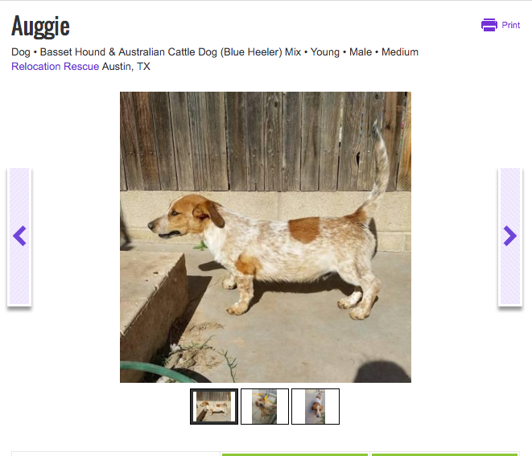

# Welcome to the CLI Pet finder!
###Pet finder is a CLI pet finder using the Pet Finder API
#####PetFinder CLI is a project by Allie Sudholt(mlleallie) and Zolon Wilkins(zolon4) for the GA WDI! 

Below are the instructions to find the pet of **your** dreams!!
First, users are prompeted to put in their zipcode. Then they are put through a series of questions to decide wheather they are a **cat** or **dog** person. After the quiz, they get their final prediction along with a real listing on PetFinder (**that's where the api comes in**). Below are some screenshots of the Pet Finder in action! If you would like to contribute to this, feel free to fork or send me a pull request!

---

